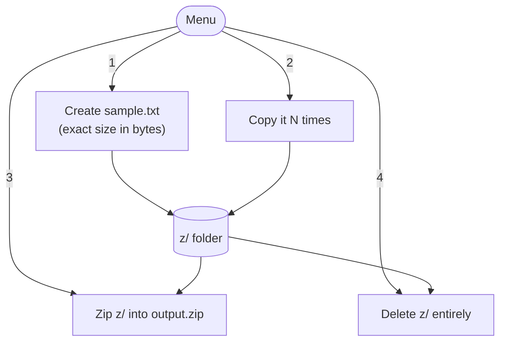

# zgen

A small, experimental, **educational** terminal tool for learning how simple **zip bombs** work. It generates highly compressible dummy files of an exact size, copies them in bulk, and zips the result — producing a small archive that expands to a much larger size on disk.

Works on Windows, macOS, and Linux — requires only Python 3.9+ and [tqdm](https://github.com/tqdm/tqdm).

> [!WARNING]
> **Disclaimer — educational use only.** This is a learning project that demonstrates data compression and the mechanics of "flat" zip bombs. It only creates *small*, single-level bombs, and the uncompressed data must be written to your own disk first (see [Limits](#limits)). Do **not** use it to create files intended to disrupt, overwhelm, or attack any system you do not own or have explicit permission to test. Extracting a large zip bomb can fill your own disk. You are responsible for how you use it. Provided as-is, with no warranty.

```
┌──────────────── zgen ────────────────┐
│  1  Create a sample file             │
│  2  Copy the sample file             │
│  3  Zip the base directory           │
│  4  Delete the base directory        │
│  q  Quit                             │
└──────────────────────────────────────┘
```

## How it works

Everything happens inside a local `z/` folder next to the script — zgen never touches files outside of it.



## Quick start

With [uv](https://docs.astral.sh/uv/) (recommended):

```sh
uv run main.py
```

Or with plain Python:

```sh
pip install tqdm
python main.py
```

## Usage

Pick an option from the menu:

1. **Create a sample file** — asks for a size in bytes and creates `z/sample.txt` with exactly that many bytes, with a progress bar.
2. **Copy the sample file** — asks for a count and creates `sample_copy_1.txt`, `sample_copy_2.txt`, … inside `z/`.
3. **Zip the base directory** — compresses the whole `z/` folder into `output.zip`.
4. **Delete the base directory** — removes `z/` and everything in it (asks for confirmation first).

## Limits

This tool intentionally only produces **small, flat** zip bombs, and it is honest about the cost:

- The archive is a single level of plain files — no recursive nesting or overlapping entries, so it **cannot** reach the extreme ratios of hand-crafted bombs (e.g. a few KB expanding to petabytes).
- The blow-up is bounded by *(compression ratio) × (number of copies)*, where DEFLATE tops out around 1032:1 on the all-zero content.
- The uncompressed data must be written to **your own disk first**, so building a large bomb is as heavy as the payload it produces.

## Notes

- All file operations are sandboxed to the `z/` folder; path traversal is rejected.
- The menu automatically falls back to plain ASCII on terminals that can't render box-drawing characters.
- Progress bars are byte-accurate and large files are written in 64 KiB chunks.
